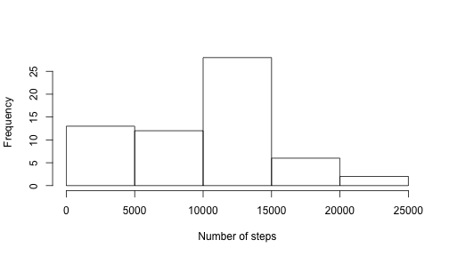
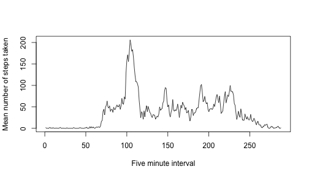
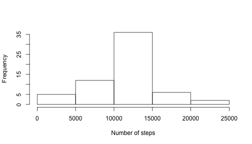
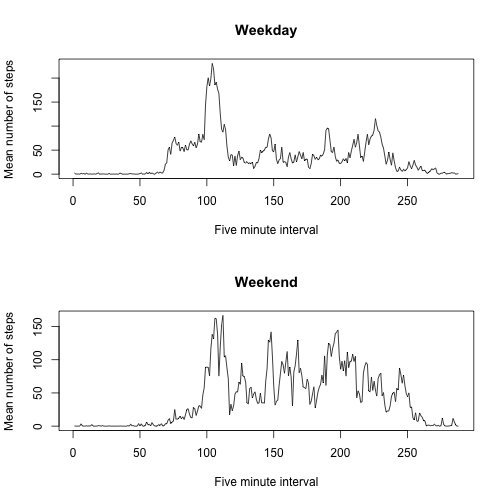

# Reproducible Research: Peer Assessment 1

The following document walks through completion of the first peer assessment for the course Reproducible Research on Coursera. 

The dataset being used describes the number of steps taken by an unnamed person over a month. Each step count was gathered at five minute intervals. 

## Loading and preprocessing the data

First, load your data into R using the read.csv() function. There are three variables in the data:

- The number of steps taken per interval
- The date that the steps were recorded
- The time interval that the steps were recorded

Before continuing, use as.Date() to insure that your date variable has been converted from character to dates. 


```r
data <- read.csv("activity.csv", header = TRUE, stringsAsFactors = FALSE)
data$date <- as.Date(data$date, format = "%Y-%m-%d")
```


## What is mean total number of steps taken per day?

We will first look at the distribution of steps taken per day. The total number of steps taken per day can be seen in the histogram below:


```r
hist(with(data, tapply(steps, date, sum, na.rm = TRUE)), xlab = "Number of steps", 
    main = "")
```

 


As can be seen above, the number of steps taken varies by day. The following table gives the mean and median for each day, further showing this variety. Note that this could have looked very pretty using the package xtable, but I couldn't get R to interpret the html output, so you will have to settle for this less pretty version. 


```r
library(plyr)
ddply(data, ~date, summarize, mean = mean(steps, na.rm = TRUE), median = median(steps, 
    na.rm = TRUE))
```

```
##          date    mean median
## 1  2012-10-01     NaN     NA
## 2  2012-10-02  0.4375      0
## 3  2012-10-03 39.4167      0
## 4  2012-10-04 42.0694      0
## 5  2012-10-05 46.1597      0
## 6  2012-10-06 53.5417      0
## 7  2012-10-07 38.2465      0
## 8  2012-10-08     NaN     NA
## 9  2012-10-09 44.4826      0
## 10 2012-10-10 34.3750      0
## 11 2012-10-11 35.7778      0
## 12 2012-10-12 60.3542      0
## 13 2012-10-13 43.1458      0
## 14 2012-10-14 52.4236      0
## 15 2012-10-15 35.2049      0
## 16 2012-10-16 52.3750      0
## 17 2012-10-17 46.7083      0
## 18 2012-10-18 34.9167      0
## 19 2012-10-19 41.0729      0
## 20 2012-10-20 36.0938      0
## 21 2012-10-21 30.6285      0
## 22 2012-10-22 46.7361      0
## 23 2012-10-23 30.9653      0
## 24 2012-10-24 29.0104      0
## 25 2012-10-25  8.6528      0
## 26 2012-10-26 23.5347      0
## 27 2012-10-27 35.1354      0
## 28 2012-10-28 39.7847      0
## 29 2012-10-29 17.4236      0
## 30 2012-10-30 34.0938      0
## 31 2012-10-31 53.5208      0
## 32 2012-11-01     NaN     NA
## 33 2012-11-02 36.8056      0
## 34 2012-11-03 36.7049      0
## 35 2012-11-04     NaN     NA
## 36 2012-11-05 36.2465      0
## 37 2012-11-06 28.9375      0
## 38 2012-11-07 44.7326      0
## 39 2012-11-08 11.1771      0
## 40 2012-11-09     NaN     NA
## 41 2012-11-10     NaN     NA
## 42 2012-11-11 43.7778      0
## 43 2012-11-12 37.3785      0
## 44 2012-11-13 25.4722      0
## 45 2012-11-14     NaN     NA
## 46 2012-11-15  0.1424      0
## 47 2012-11-16 18.8924      0
## 48 2012-11-17 49.7882      0
## 49 2012-11-18 52.4653      0
## 50 2012-11-19 30.6979      0
## 51 2012-11-20 15.5278      0
## 52 2012-11-21 44.3993      0
## 53 2012-11-22 70.9271      0
## 54 2012-11-23 73.5903      0
## 55 2012-11-24 50.2708      0
## 56 2012-11-25 41.0903      0
## 57 2012-11-26 38.7569      0
## 58 2012-11-27 47.3819      0
## 59 2012-11-28 35.3576      0
## 60 2012-11-29 24.4688      0
## 61 2012-11-30     NaN     NA
```


Note that most of the median values are zero. This reflects the large number of intervals in each day that this person was not moving. This further suggests that the number of steps was localized to only a minority of time intervals recorded. 

## What is the average daily activity pattern?

To further investigate this variance in steps taken per time interval, the below plot displays the mean numbers of steps for each time interval over the entire recording period. 


```r
intmean <- with(data, tapply(steps, interval, mean, na.rm = TRUE))
plot(intmean, type = "l", xlab = "Five minute interval", ylab = "Mean number of steps taken")
```

 


The periods of inactivity seem to focus on the early and late time intervals for each day, likely when this person was sleeping. During their waking hours, there is at least some activity in each interval, but notice the large spikes in the plot, particular near the 100th interval range.

You can use the following code to retrieve the maximum average number of steps taken and identifying that time interval.


```r
intmean[which.max(abs(intmean))]
```

```
##   835 
## 206.2
```


Each interval is named as an interpretable time. For this person, it appears the maximum average number of steps taken is 206.2 during the interval between 8:35 and 8:40am. 

## Imputing missing values

Another thing to note is the large number of NA and NaN values in the above calculations. This is due to the fact that there are large amounts of data missing, including full days worth. The following code will output the total number of intervals that are missing data.


```r
nrow(data[!complete.cases(data), ])
```

```
## [1] 2304
```


In total, there are 2,304 time intervals where the number of steps taken was not recorded. How much of the entire data set does this constitute? Taking a quick percentage:


```r
nrow(data[!complete.cases(data), ])/nrow(data)
```

```
## [1] 0.1311
```


We can see that this is a full 13% of the data! 

While analysts vary in how they deal with missing values, for the purposes of this project, we will be filling in the missing values. I have decided to use the average number of steps per interval to fill in the missing values, since every interval has at least one data point. The alternative, using the mean of each day to fill in the missing values, would not help for the days where there is no data. 

The following recreates our data set with all the missing values replaced by the interval mean. 


```r
dataNA = data.frame(matrix(vector(), nrow(data), 3, dimnames = list(c(), c("steps", 
    "date", "interval"))), stringsAsFactors = F)
dataNA$steps <- ifelse(is.na(data$steps), intmean[as.character(data$interval)], 
    data$steps)
dataNA$date <- data$date
dataNA$interval <- data$interval
```


We can now recreate the histogram showing the total number of steps taken per day. 


```r
hist(with(dataNA, tapply(steps, date, sum)), xlab = "Number of steps", main = " ")
```

 


While the histogram still peaks at the same number of steps, the distribution has become more normal. This is due to the fact that many of the days that had a low number of steps only did so due to missing values. 

We can also calculate the mean and median number of steps taken per day for this new dataset. 


```r
ddply(dataNA, ~date, summarize, mean = mean(steps, na.rm = TRUE), median = median(steps, 
    na.rm = TRUE))
```

```
##          date    mean median
## 1  2012-10-01 37.3826  34.11
## 2  2012-10-02  0.4375   0.00
## 3  2012-10-03 39.4167   0.00
## 4  2012-10-04 42.0694   0.00
## 5  2012-10-05 46.1597   0.00
## 6  2012-10-06 53.5417   0.00
## 7  2012-10-07 38.2465   0.00
## 8  2012-10-08 37.3826  34.11
## 9  2012-10-09 44.4826   0.00
## 10 2012-10-10 34.3750   0.00
## 11 2012-10-11 35.7778   0.00
## 12 2012-10-12 60.3542   0.00
## 13 2012-10-13 43.1458   0.00
## 14 2012-10-14 52.4236   0.00
## 15 2012-10-15 35.2049   0.00
## 16 2012-10-16 52.3750   0.00
## 17 2012-10-17 46.7083   0.00
## 18 2012-10-18 34.9167   0.00
## 19 2012-10-19 41.0729   0.00
## 20 2012-10-20 36.0938   0.00
## 21 2012-10-21 30.6285   0.00
## 22 2012-10-22 46.7361   0.00
## 23 2012-10-23 30.9653   0.00
## 24 2012-10-24 29.0104   0.00
## 25 2012-10-25  8.6528   0.00
## 26 2012-10-26 23.5347   0.00
## 27 2012-10-27 35.1354   0.00
## 28 2012-10-28 39.7847   0.00
## 29 2012-10-29 17.4236   0.00
## 30 2012-10-30 34.0938   0.00
## 31 2012-10-31 53.5208   0.00
## 32 2012-11-01 37.3826  34.11
## 33 2012-11-02 36.8056   0.00
## 34 2012-11-03 36.7049   0.00
## 35 2012-11-04 37.3826  34.11
## 36 2012-11-05 36.2465   0.00
## 37 2012-11-06 28.9375   0.00
## 38 2012-11-07 44.7326   0.00
## 39 2012-11-08 11.1771   0.00
## 40 2012-11-09 37.3826  34.11
## 41 2012-11-10 37.3826  34.11
## 42 2012-11-11 43.7778   0.00
## 43 2012-11-12 37.3785   0.00
## 44 2012-11-13 25.4722   0.00
## 45 2012-11-14 37.3826  34.11
## 46 2012-11-15  0.1424   0.00
## 47 2012-11-16 18.8924   0.00
## 48 2012-11-17 49.7882   0.00
## 49 2012-11-18 52.4653   0.00
## 50 2012-11-19 30.6979   0.00
## 51 2012-11-20 15.5278   0.00
## 52 2012-11-21 44.3993   0.00
## 53 2012-11-22 70.9271   0.00
## 54 2012-11-23 73.5903   0.00
## 55 2012-11-24 50.2708   0.00
## 56 2012-11-25 41.0903   0.00
## 57 2012-11-26 38.7569   0.00
## 58 2012-11-27 47.3819   0.00
## 59 2012-11-28 35.3576   0.00
## 60 2012-11-29 24.4688   0.00
## 61 2012-11-30 37.3826  34.11
```


Overall, most of the values for days with data remain unchanged. For days that had only missing values, there is a large change in the data, since there is now actually data there! This is especially apparent for the median values, since these are the only days that have a median that is not zero. 

## Are there differences in activity patterns between weekdays and weekends?

Overall, we have found that the number of steps taken by a person depends greatly on the time of day that the number of steps was recorded. This makes intuitive sense: people generally have a daily routine that involves more activity at certain hours and less (or no!) activity at others. 

Another part of a person routine is the difference between weekends and weekdays. For most people, the weekends involve a very different schedule than weekdays. Can we see these differences reflected in the number of steps this particular person took during the time their steps were recorded? 

In order to investigate this, we must first create a factor that will split our data between weekdays and weekends. I did this by first creating a factor that named the day of the week for each row. A second factor was created based on this one that separated weekdays from weekends.


```r
dataNA$day <- weekdays(dataNA$date)
dataNA$dayType <- ifelse(dataNA$day == "Saturday" | dataNA$day == "Sunday", 
    "Weekend", "Weekday")
```


Using this new factor, we can now look at the mean number of steps taken for each time interval per type of day. 


```r
intmeanNA <- with(dataNA, tapply(steps, list(interval, dayType), mean))
par(mfrow = c(2, 1))
plot(intmeanNA[, 1], type = "l", ylab = "Mean number of steps", xlab = "Five minute interval", 
    main = "Weekday")
plot(intmeanNA[, 2], type = "l", ylab = "Mean number of steps", xlab = "Five minute interval", 
    main = "Weekend")
```

 


Overall, it appears that this person is much more active on the weekends than they are during the work week. Instead of just a few peaks of activity during the day, there are many peaks of activity with fewer periods of inactivity.  
